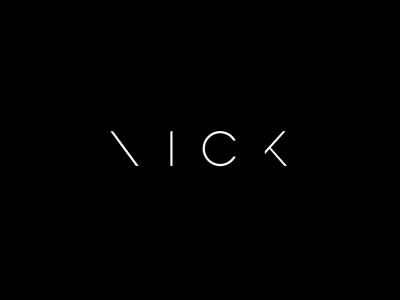

  
  
  

<h1 align="center">Hi , I'm Nick</h1>

  

## 👦 About Me

<h3 align="center">I'm Nick Russell, a 23-year-old Bolivian Independent FullStack Developer, a weird guy who likes to do weird things with technologies and related to design, developing experiences and web applications. When I'm not working or playing, I plan how to escape from the University.</h3>

-   👨‍💻 All of my projects are available at [https://nick-russell.vercel.app/](https://nick-russell.vercel.app/) 

-   💬 Ask me about **react, vue, angular**

-   📫 How to reach me **nick077n@gmail.com**

-   👯 We can connect to play some games ♟

-   ⚡ Fun fact **Je connais un peu le français**

---

## 📈 GitHub Stats

  
  

 

  
  

 

---

## 🔧 Technologies & Tools

| Frontend Technologies                                                                                                               | Backend Technologies                                                                                                                | Databases                                                                                                                                       | Tools & Libraries                                                                                                                           | Deployment Tools                                                                                                                      |
| ----------------------------------------------------------------------------------------------------------------------------------- | ----------------------------------------------------------------------------------------------------------------------------------- | ----------------------------------------------------------------------------------------------------------------------------------------------- | ------------------------------------------------------------------------------------------------------------------------------------------- | ------------------------------------------------------------------------------------------------------------------------------------- |
|                 |  |  |             |                |
|                    |           |                       |      |             |
|  |     |                    |  |  |
|                |        |                                                                                                                                                 |             |                                                                                                                                       |
|           |                                                                                                                                     |                                                                                                                                                 |                         |                                                                                                                                       |
|             |                                                                                                                                     |                                                                                                                                                 |      |                                                                                                                                       |
|                    |                                                                                                                                     |                                                                                                                                                 |                |                                                                                                                                       |
|                                                                                                                                     |                                                                                                                                     |                                                                                                                                                 |                            |                                                                                                                                       |

---

<!--START_SECTION:waka-->

<!--END_SECTION:waka-->

⏳ **Year Progress**  ■■■▢▢▢▢▢▢▢▢▢▢▢▢▢▢▢▢▢▢▢▢▢▢▢▢▢▢▢  11.25 % as on ⏰ 11-Feb-2026

---
## 🏆 Achievements

---
## 📫 Connect with Me

